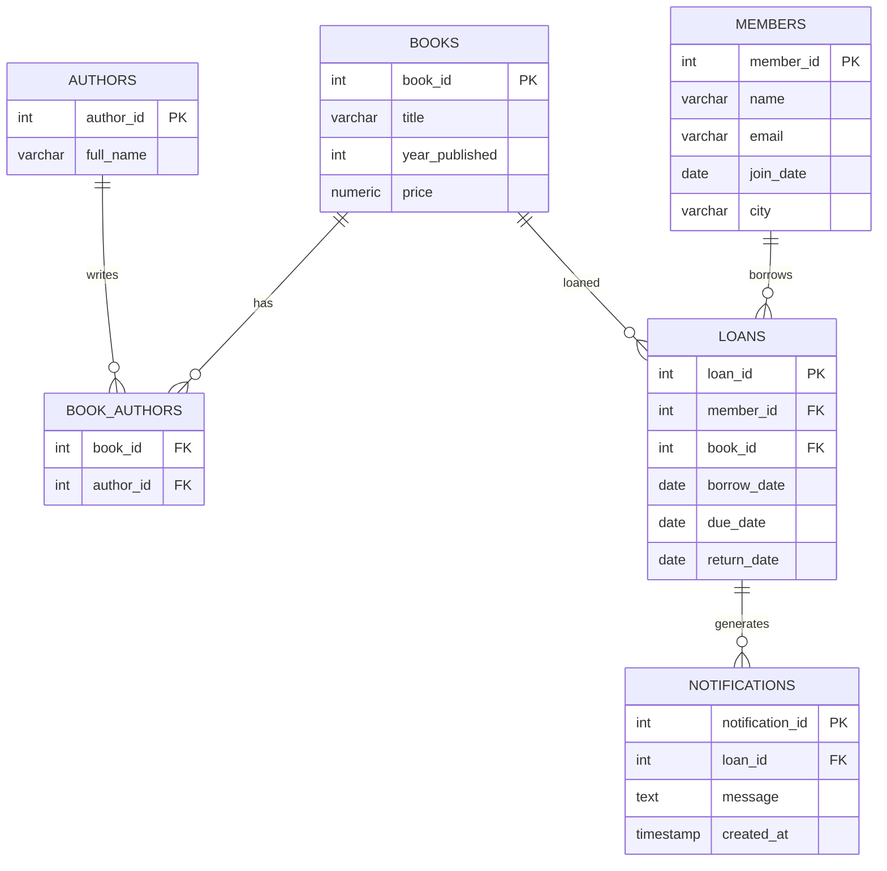

```mermaid
erDiagram
    MEMBERS {
        int member_id PK
        varchar name
        varchar email
        date join_date
        varchar city
    }
    BOOKS {
        int book_id PK
        varchar title
        int year_published
        numeric price
    }
    AUTHORS {
        int author_id PK
        varchar full_name
    }
    BOOK_AUTHORS {
        int book_id FK
        int author_id FK
    }
    LOANS {
        int loan_id PK
        int member_id FK
        int book_id FK
        date borrow_date
        date due_date
        date return_date
    }
    NOTIFICATIONS {
        int notification_id PK
        int loan_id FK
        text message
        timestamp created_at
    }

    MEMBERS ||--o{ LOANS : "borrows"
    BOOKS ||--o{ LOANS : "loaned"
    AUTHORS ||--o{ BOOK_AUTHORS : "writes"
    BOOKS ||--o{ BOOK_AUTHORS : "has"
    LOANS ||--o{ NOTIFICATIONS : "generates"
```